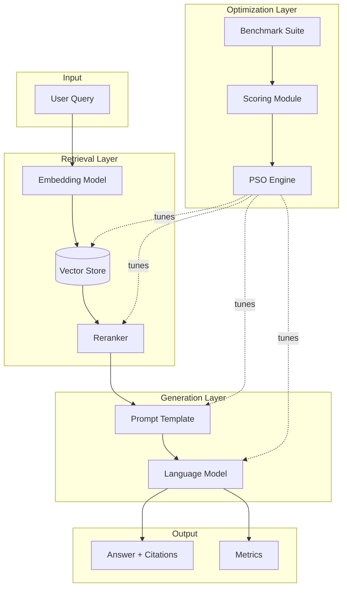

## PSO + LLM Optimization System (Discussed 2026-02-17)

### Background
Kingsley wrote a thesis on PSO (Particle Swarm Optimization) performance degradation in high-dimensional spaces. Key findings:
- PSO scales linearly up to ~40 dimensions on separable unimodal functions (Sphere)
- Success rate drops rapidly above 50D (90% → <40% at 60D)
- PSO fails completely on multimodal functions (Rastrigin) - trapped in local minima
- Suggested cooperative coevolution as future work

### Implications for LLM System Optimization
LLM tuning landscapes are worse than Rastrigin: multimodal, noisy, partially discrete, non-stationary, correlated dimensions. Effective dimensional threshold is likely 8-15 dimensions before severe degradation.

### Architecture Design Principles (from thesis)
1. **Decomposition is mandatory** - partition parameters into independent blocks
2. **Stage-wise optimization** - optimize each block separately (5-7 dims each), freeze, move to next
3. **Hard limit: 8-10 dimensions per optimization run**
4. **Consider PSO variants**: cooperative coevolutionary PSO, hybrid PSO + Bayesian, multi-swarm

### MVP Target
"RAG assistant that answers from internal corpus with citations — optimized by PSO for quality, cost, and latency"

Success metrics:
- Answer quality: ≥80% acceptable (rubric-based)
- Groundedness: ≥90% with correct citations  
- Cost: ≤$0.02-$0.08 per query
- Latency: p95 ≤6-12 seconds
- Safety: ≤1% policy violations

Benchmark structure (100 questions):
- 50 factual (in docs)
- 20 multi-hop (combine 2 sources)
- 15 "not in docs" (must refuse)
- 15 policy-sensitive (safe handling)

### Parameter Blocks for Optimization
| Block | Parameters | Dimensions |
|-------|-----------|------------|
| Retrieval | chunk_size, overlap, top_k, similarity_threshold, reranker_weight | 5-7 |
| Prompt | system_template, example_set, temperature, output_constraints | 3-6 |
| Decoding | top_p, max_tokens | 2-3 |
| Routing | confidence_thresholds, model_selection, tool_budget | 3-5 |

### UI Structure (Three Layers)
1. **Use Mode** - Clean end-user panel: query, answer, citations, confidence, cost/latency
2. **Inspect Mode** - Transparency drawer: model info, retrieval params, agent trace, metrics
3. **Optimise Mode** - PSO dashboard: parameter blocks, swarm controls, convergence graphs, dimension limit display

Key UI element: `Active Dimensions: 6 / 10` - enforces thesis insight in interface

### Strategic Positioning
- Either product prototype or Atlas differentiator
- Positioning: "AI System Configuration & Optimisation Console" not "chatbot"
- Kingsley's thesis becomes competitive advantage - understanding WHY naive "optimize everything" fails

### Phase Plan
- Phase 1 (Week 1-2): RAG + benchmark + scoring
- Phase 2 (Week 2-3): PSO tuning for RAG + prompts
- Phase 3 (Week 3-4): Agent + tool routing + model routing
- Phase 4 (later): Fine-tuning (optional)

---

## Implementation Decisions (2026-03-28)

### Technology Stack
- **Language**: Python
- **Framework**: LangChain
- **Embeddings**: OpenAI embeddings
- **Vector Store**: Chroma (dev) → Pinecone (prod)
- **Evaluation**: RAGAS for automated scoring

### Corpus Strategy
- **Initial corpus**: FCA Handbook (public, free)
  - Start with COBS (Conduct of Business Sourcebook) section
  - Expand to SYSC, PRIN as needed
- **Rationale**: Public regulatory documents avoid confidentiality issues while providing real financial sector content

### Benchmark Questions
- **Source**: Banker friend to provide 15-20 realistic questions
- **Approach**: Start with 20 questions, not 100 (iterate quickly)
- **Question types needed**:
  - Factual lookup (e.g., "What are the disclosure requirements for...")
  - Multi-hop (combine sources)
  - Out-of-scope (should refuse gracefully)
  - Policy-sensitive (safe handling required)

### Architecture Diagram (Mermaid)

Export at: https://mermaid.live

### Next Steps
1. Download FCA handbook COBS sections (PDF → text)
2. Get 15-20 questions from banker friend
3. Set up basic RAG pipeline with Chroma
4. Create scoring rubric for evaluation
